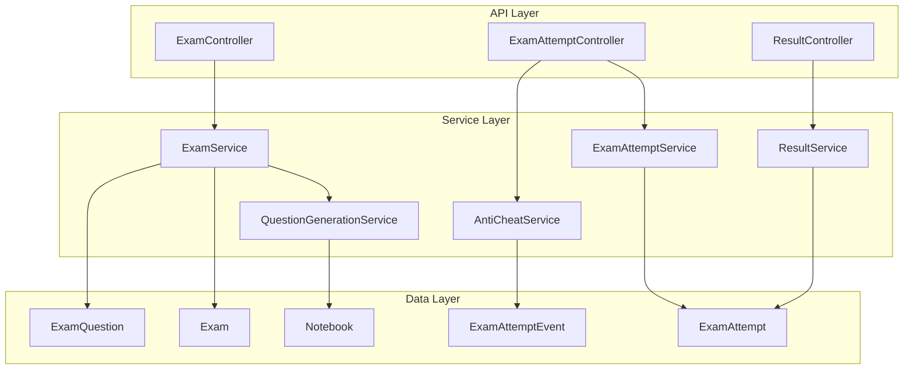

# Design Document: Exam API Optimization

## Overview

This design document outlines the architecture for optimizing the online exam system API. The system follows a clean separation of concerns with three main domains: Exam Configuration, Exam Attempts, and Results Management. The design prioritizes API clarity, extensibility, and proper state management while supporting future enhancements like essay questions, programming challenges, and advanced anti-cheat measures.

## Architecture

The exam system follows a layered architecture with clear domain boundaries:



## Components and Interfaces

### 1. Exam Management Component

**ExamController** handles exam lifecycle operations:
- `POST /api/exams` - Create exam (status: DRAFT)
- `POST /api/exams/{examId}/generate` - Generate questions (status: GENERATED)
- `GET /api/exams/{examId}/preview` - Preview complete exam with answers
- `PUT /api/exams/{examId}/publish` - Publish exam (status: PUBLISHED)
- `PUT /api/exams/{examId}/cancel` - Cancel exam (status: CANCELLED)
- `DELETE /api/exams/{examId}` - Delete exam (DRAFT only, no attempts)
- `GET /api/exams/lecturer` - List lecturer's exams
- `GET /api/exams/class/{classId}` - List class exams

**ExamService** manages exam business logic:
```java
public interface ExamService {
    ExamResponse createExam(CreateExamRequest request);
    void generateQuestions(Long examId, GenerateQuestionsRequest request);
    ExamPreviewResponse previewExam(Long examId);
    void publishExam(Long examId);
    void cancelExam(Long examId);
    void deleteExam(Long examId);
    List<ExamResponse> getLecturerExams(Long lecturerId);
    List<ExamResponse> getClassExams(Long classId);
}
```

### 2. Exam Attempt Component

**ExamAttemptController** handles student exam interactions:
- `GET /api/exams/{examId}/can-take` - Check exam eligibility
- `POST /api/exams/{examId}/attempts` - Start exam attempt
- `POST /api/exam-attempts/{attemptId}/submit` - Submit completed exam
- `POST /api/exam-attempts/{attemptId}/proctoring-event` - Record anti-cheat events
- `GET /api/exams/available` - List available exams for student

**ExamAttemptService** manages attempt lifecycle:
```java
public interface ExamAttemptService {
    boolean canTakeExam(Long examId, Long studentId);
    ExamAttemptResponse startExam(Long examId, Long studentId);
    ExamResultResponse submitExam(Long attemptId, SubmitExamRequest request);
    List<ExamResponse> getAvailableExams(Long studentId);
}
```

### 3. Anti-Cheat Component

**AntiCheatService** monitors exam integrity:
```java
public interface AntiCheatService {
    void recordProctoringEvent(Long attemptId, ProctoringEventRequest event);
    List<ProctoringEvent> getAttemptEvents(Long attemptId);
    boolean isSuspiciousActivity(Long attemptId);
}
```

**Proctoring Event Types:**
- `TAB_SWITCH` - Student switched browser tabs
- `WINDOW_FOCUS_LOST` - Exam window lost focus
- `COPY_PASTE_DETECTED` - Copy/paste activity detected
- `FULL_SCREEN_EXIT` - Student exited full-screen mode
- `MULTIPLE_SESSIONS` - Multiple exam sessions detected

### 4. Results Component

**ResultController** handles result access and export:
- `GET /api/exams/{examId}/result` - Individual student result
- `GET /api/exams/{examId}/results` - All exam results
- `GET /api/exams/{examId}/export` - Export results (Excel/CSV)

**ResultService** manages result calculations and exports:
```java
public interface ResultService {
    ExamResultResponse getStudentResult(Long examId, Long studentId);
    List<ExamResultResponse> getAllResults(Long examId);
    byte[] exportResults(Long examId, ExportFormat format, Long classId);
}
```

## Data Models

### Core Entities

**Exam Entity:**
```java
@Entity
public class Exam {
    private Long id;
    private String title;
    private String description;
    private LocalDateTime startTime;
    private LocalDateTime endTime;
    private Integer duration; // minutes
    private ExamStatus status; // DRAFT, GENERATED, PUBLISHED, CANCELLED
    private Long lecturerId;
    private Long classId;
    private Integer totalQuestions;
    private Integer totalPoints;
    private LocalDateTime createdAt;
    private LocalDateTime updatedAt;
}
```

**ExamQuestion Entity:**
```java
@Entity
public class ExamQuestion {
    private Long id;
    private Long examId;
    private String questionText;
    private QuestionType type; // MULTIPLE_CHOICE, TRUE_FALSE, ESSAY, PROGRAMMING
    private String correctAnswer;
    private Integer points;
    private Integer orderIndex;
    private String metadata; // JSON for extensibility
}
```

**ExamAttempt Entity:**
```java
@Entity
public class ExamAttempt {
    private Long id;
    private Long examId;
    private Long studentId;
    private LocalDateTime startTime;
    private LocalDateTime endTime;
    private LocalDateTime submittedAt;
    private AttemptStatus status; // IN_PROGRESS, SUBMITTED, TIMED_OUT
    private Integer score;
    private String questionsSnapshot; // JSON snapshot of questions
    private String answers; // JSON of student answers
    private Integer proctoringFlags;
}
```

**ExamAttemptEvent Entity:**
```java
@Entity
public class ExamAttemptEvent {
    private Long id;
    private Long attemptId;
    private String eventType;
    private Integer eventCount;
    private LocalDateTime firstOccurrence;
    private LocalDateTime lastOccurrence;
    private String metadata; // JSON for event details
}
```

## Correctness Properties

*A property is a characteristic or behavior that should hold true across all valid executions of a system-essentially, a formal statement about what the system should do. Properties serve as the bridge between human-readable specifications and machine-verifiable correctness guarantees.*

### Property Reflection

After analyzing all acceptance criteria, I identified several properties that can be consolidated to eliminate redundancy:

- Properties 1.1 and 1.2 can be combined into a comprehensive exam state management property
- Properties 2.1 and 2.2 can be combined into a question generation property
- Properties 3.1, 3.2, and 3.3 can be combined into a comprehensive deletion control property
- Properties 4.2, 4.3, and 4.4 can be combined into an exam attempt creation property
- Properties 5.1 and 5.2 can be combined into an anti-cheat event recording property
- Properties 6.2 and 6.3 can be combined into a result aggregation property
- Properties 7.1 and 7.2 can be combined into an export functionality property

### Core Properties

**Property 1: Exam Status Management**
*For any* exam, the status should transition correctly through the lifecycle (DRAFT → GENERATED → PUBLISHED → CANCELLED) and each status should enforce appropriate access controls
**Validates: Requirements 1.1, 1.2, 1.4, 1.6**

**Property 2: Question Generation and Status Transition**
*For any* exam with a valid notebook, generating questions should create exam questions in the database and transition status to GENERATED
**Validates: Requirements 1.3, 2.1, 2.2**

**Property 3: Exam Preview Immutability**
*For any* exam, previewing should display all questions, answers, and scoring information without changing the exam status
**Validates: Requirements 2.3, 2.4**

**Property 4: Time-Based Availability**
*For any* published exam, when the current time reaches the start time, the exam should automatically become available to eligible students
**Validates: Requirements 1.5**

**Property 5: Deletion Access Control**
*For any* exam, deletion should only succeed when status is DRAFT and no exam attempts exist, otherwise it should be prevented with an error
**Validates: Requirements 3.1, 3.2, 3.3**

**Property 6: Student Eligibility Verification**
*For any* student and exam combination, eligibility checking should correctly evaluate exam status, timing, and student enrollment
**Validates: Requirements 4.1**

**Property 7: Exam Attempt Creation**
*For any* eligible student starting an exam, the system should create an attempt record, snapshot current questions, and initialize the timer
**Validates: Requirements 4.2, 4.3, 4.4**

**Property 8: Exam Submission Processing**
*For any* exam attempt submission, the system should calculate scores correctly and finalize the attempt status
**Validates: Requirements 4.5**

**Property 9: Anti-Cheat Event Recording**
*For any* monitored action during an exam, the system should record the event with correct attempt ID, event type, and occurrence count
**Validates: Requirements 5.1, 5.2**

**Property 10: Suspicious Activity Flagging**
*For any* exam attempt with suspicious behavior patterns, the system should flag the attempt for review
**Validates: Requirements 5.3**

**Property 11: Individual Result Access**
*For any* completed exam, students should be able to access their individual results
**Validates: Requirements 6.1**

**Property 12: Result Aggregation and Information**
*For any* exam with multiple attempts, lecturers should receive aggregate results including scores, completion times, and anti-cheat event summaries
**Validates: Requirements 6.2, 6.3**

**Property 13: Result Filtering**
*For any* result request with class or student group filters, only results matching the specified criteria should be returned
**Validates: Requirements 6.4**

**Property 14: Export Functionality**
*For any* exam result export request, the system should generate files in the requested format (Excel/CSV) containing student information, scores, and completion details
**Validates: Requirements 7.1, 7.2**

**Property 15: Export Filtering**
*For any* export request with class filtering, only students from the specified class should be included in the exported results
**Validates: Requirements 7.3**

**Property 16: Backward Compatibility**
*For any* existing exam, extending exam formats should not break the exam's functionality or data integrity
**Validates: Requirements 9.3**

<function_calls>
<invoke name="prework">
<parameter name="featureName">exam-api-optimization

## Error Handling

The system implements comprehensive error handling across all components:

### Exam Management Errors
- **ExamNotFoundException**: When attempting operations on non-existent exams
- **InvalidExamStatusException**: When attempting operations not allowed for current exam status
- **ExamDeletionNotAllowedException**: When attempting to delete exams with attempts or non-DRAFT status
- **QuestionGenerationException**: When notebook content is insufficient or invalid for question generation

### Exam Attempt Errors
- **ExamNotAvailableException**: When students attempt to access unavailable exams
- **ExamAlreadyStartedException**: When students attempt to start an exam they've already begun
- **ExamTimeExpiredException**: When students attempt to submit after time limit
- **InvalidSubmissionException**: When submission data is malformed or incomplete

### Anti-Cheat Errors
- **InvalidProctoringEventException**: When proctoring event data is malformed
- **AttemptNotFoundException**: When recording events for non-existent attempts

### Result and Export Errors
- **ResultNotAvailableException**: When results are requested before exam completion
- **ExportGenerationException**: When export file generation fails
- **InvalidExportFormatException**: When unsupported export format is requested

### Global Error Response Format
```json
{
  "error": {
    "code": "EXAM_NOT_FOUND",
    "message": "Exam with ID 123 not found",
    "timestamp": "2024-12-25T10:30:00Z",
    "path": "/api/exams/123"
  }
}
```

## Testing Strategy

The exam API optimization will be validated through a dual testing approach combining unit tests and property-based tests to ensure comprehensive coverage and correctness.

### Property-Based Testing

Property-based tests will validate universal properties across all inputs using **JUnit 5** with **jqwik** library for Java. Each property test will run a minimum of 100 iterations to ensure thorough validation.

**Configuration:**
- Testing Framework: JUnit 5 + jqwik
- Minimum iterations per property: 100
- Test data generation: Custom generators for exam entities, student data, and timing scenarios

**Property Test Examples:**
```java
@Property
@Label("Feature: exam-api-optimization, Property 1: Exam Status Management")
void examStatusTransitionsCorrectly(@ForAll ExamData examData) {
    // Test that exam status transitions follow the correct lifecycle
}

@Property  
@Label("Feature: exam-api-optimization, Property 7: Exam Attempt Creation")
void examAttemptCreationIsComplete(@ForAll StudentData student, @ForAll ExamData exam) {
    // Test that starting an exam creates attempt, snapshots questions, and starts timer
}
```

### Unit Testing

Unit tests will focus on specific examples, edge cases, and integration points:

**Exam Management Tests:**
- Exam creation with various configurations
- Question generation from different notebook types
- Status transition edge cases
- Deletion permission validation

**Exam Attempt Tests:**
- Eligibility checking with various student/exam combinations
- Timer management and expiration handling
- Submission processing with different answer formats
- Anti-cheat event recording accuracy

**Result and Export Tests:**
- Score calculation accuracy
- Result filtering and aggregation
- Export file format validation
- Class-based filtering correctness

### Integration Testing

Integration tests will validate end-to-end workflows:
- Complete exam lifecycle from creation to result export
- Student exam-taking experience with anti-cheat monitoring
- Multi-user scenarios with concurrent exam attempts
- Database transaction integrity during high-load scenarios

### Test Data Management

**Test Generators:**
- ExamDataGenerator: Creates valid exam configurations with various statuses
- StudentDataGenerator: Generates student profiles with different enrollment statuses
- NotebookDataGenerator: Creates notebook content suitable for question generation
- TimingDataGenerator: Generates realistic exam timing scenarios

**Test Database:**
- In-memory H2 database for unit tests
- Testcontainers with PostgreSQL for integration tests
- Automated test data cleanup between test runs

This comprehensive testing strategy ensures that the exam API optimization meets all functional requirements while maintaining high code quality and system reliability.